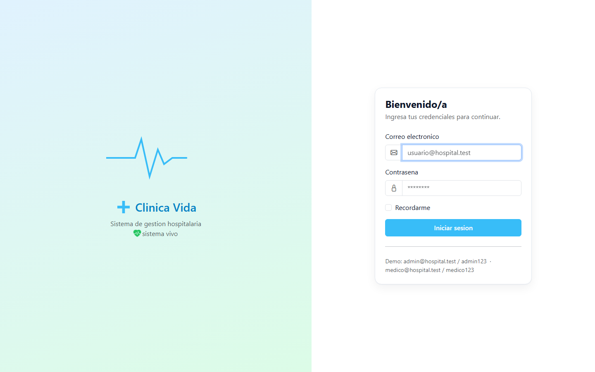
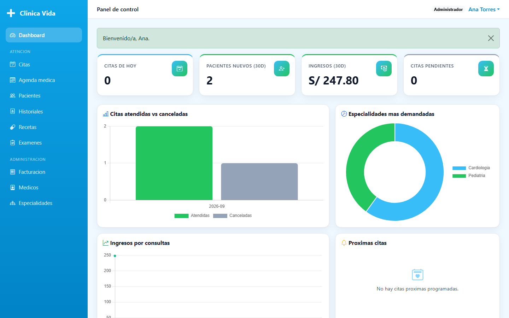
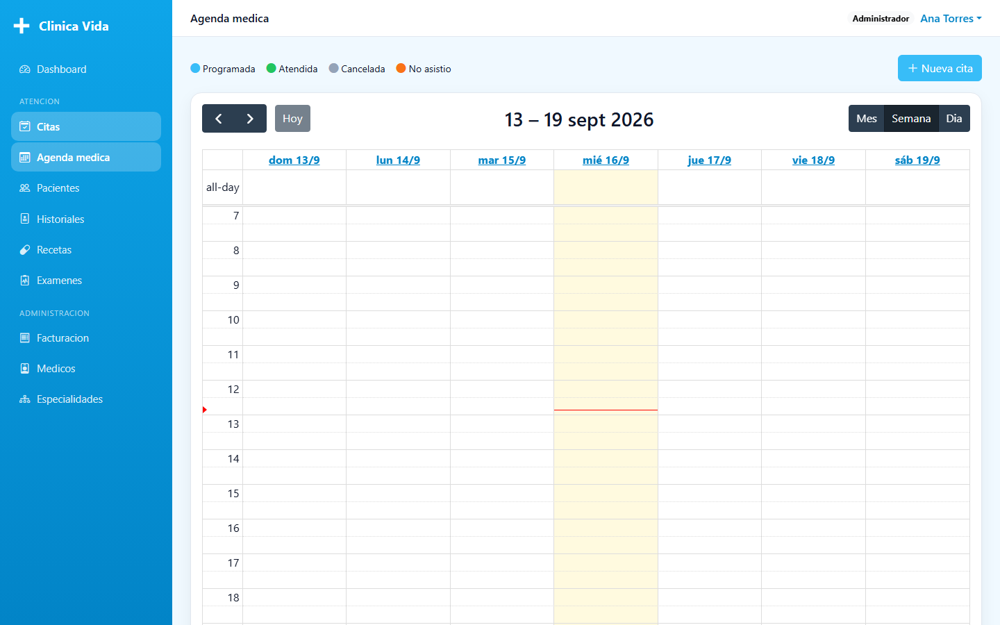
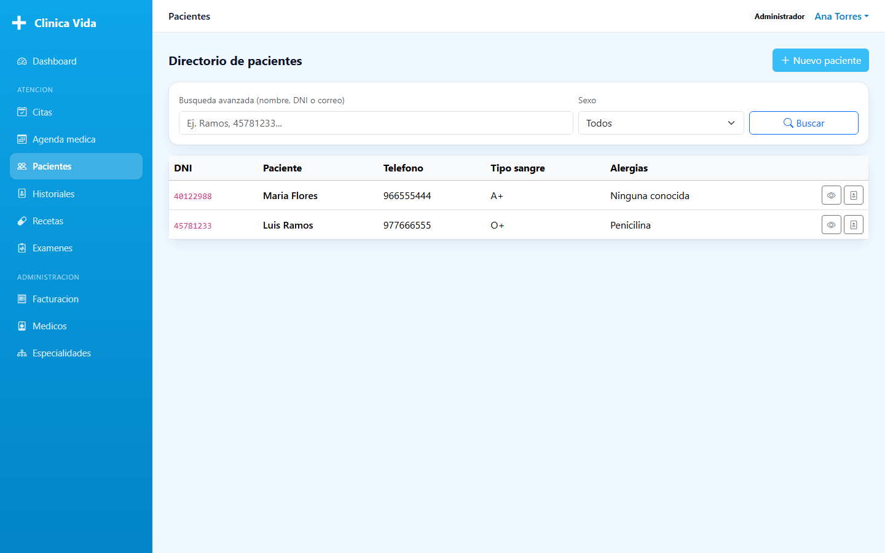

# Sistema de Gestion Hospitalaria / Citas Medicas

Aplicacion web **Flask + PostgreSQL** siguiendo el patron **MVC**:

## Capturas

| Login | Dashboard |
|---|---|
|  |  |

| Agenda medica | Pacientes |
|---|---|
|  |  |

| Capa | Carpeta | Rol |
|------|---------|-----|
| **Modelo** | `app/models/` | Entidades y acceso a datos (SQLAlchemy) |
| **Controlador** | `app/controllers/` | Blueprints con la logica de rutas |
| **Vista** | `app/templates/` | HTML + Bootstrap 5, Chart.js, FullCalendar |

## Funcionalidades

1. Login con roles: `administrador`, `medico`, `recepcionista`, `paciente` (acceso por rol via `@role_required`).
2. Dashboard con KPIs y graficos Chart.js: citas atendidas vs canceladas, especialidades mas demandadas, ingresos por consultas. Loader tipo "latido".
3. Historial clinico digital por paciente (diagnosticos, tratamientos, alergias).
4. Agenda medica con calendario interactivo (FullCalendar.js) - endpoint `/api/citas`.
5. Recetas medicas digitales descargables en **PDF** (ReportLab) - `/recetas/<id>/pdf`.
6. Modulo de facturacion (subtotal + IGV 18% + total, estados).
7. Busqueda avanzada de pacientes por nombre, DNI o correo (`/pacientes` y `/api/pacientes/buscar`).
8. Notificaciones de citas proximas en el dashboard.

## Paleta (variables CSS en `app/static/css/style.css`)

`--celeste #38BDF8` · `--blanco #FFFFFF` · `--verde #22C55E` · `--gris #94A3B8`

## Puesta en marcha

```bash
python -m venv .venv
.venv\Scripts\activate            # Windows PowerShell:  .venv\Scripts\Activate.ps1
pip install -r requirements.txt

copy .env.example .env            # ajusta DATABASE_URL

# Crear la base en PostgreSQL
createdb hospital_mvc

# Opcion A: crear tablas + datos demo
flask --app run.py seed

# Opcion B: usar migraciones
flask --app run.py db init
flask --app run.py db migrate -m "inicial"
flask --app run.py db upgrade

python run.py
```

Abre http://127.0.0.1:5000

### Usuarios demo (tras `flask --app run.py seed`)

| Rol | Email | Password |
|-----|-------|----------|
| Administrador | admin@hospital.test | admin123 |
| Medico | medico@hospital.test | medico123 |
| Recepcionista | recepcion@hospital.test | recep123 |
| Paciente | paciente@hospital.test | paciente123 |

## Estructura

```
hospital_mvc/
├── run.py                 # punto de entrada
├── config.py              # configuracion + paleta
├── schema.sql             # DDL PostgreSQL de referencia
├── requirements.txt
└── app/
    ├── __init__.py        # application factory (registra blueprints)
    ├── extensions.py      # db, login_manager, migrate
    ├── cli.py             # comandos: init-db, seed
    ├── models/            # 9 entidades
    ├── controllers/       # auth, dashboard, pacientes, medicos, especialidades,
    │                      # citas, historiales, recetas, examenes, facturas, api
    ├── services/pdf_service.py
    ├── utils/decorators.py  # @role_required
    ├── templates/
    └── static/
```
